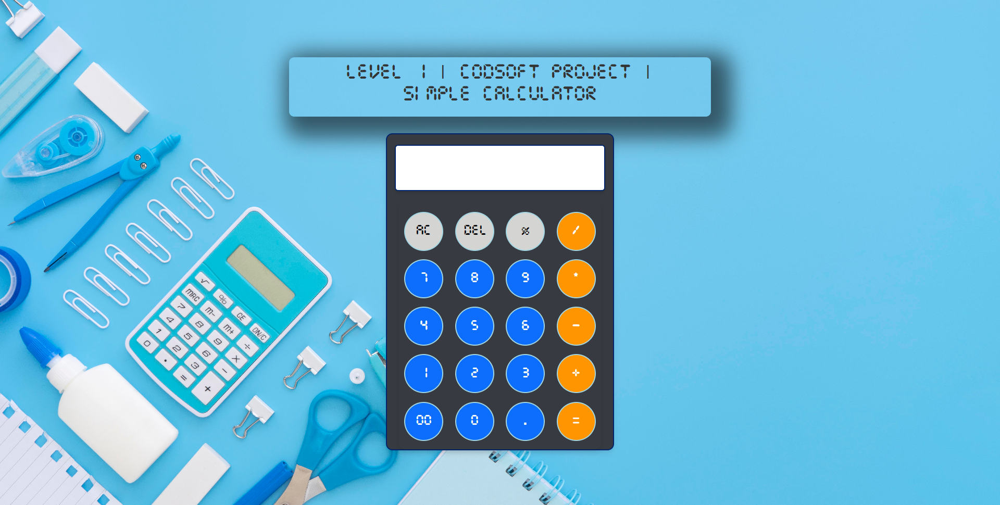

Sure! Here's a more concise version of the README:

---

# Simple Calculator 🧮

A basic web-based calculator application built using HTML, CSS, and JavaScript. This calculator allows users to perform simple arithmetic operations such as addition, subtraction, multiplication, and division, as well as percentage calculations.



## Features ✨

- **Basic Arithmetic Operations**: Addition, subtraction, multiplication, and division.
- **Percentage Calculation**: Calculate percentages of numbers.
- **Keyboard Support**: Perform calculations using keyboard inputs.
- **Responsive Design**: Ensures the calculator functions well on various screen sizes.

## Live Demo 🌐

Try the live demo [here](https://jigarparmar313.github.io/codsoft-calculator/).

## Installation 🚀

To run the calculator locally:

1. Clone the repository:
   ```bash
   git clone https://github.com/your-username/simple-calculator.git
   ```
2. Navigate into the project directory:
   ```bash
   cd simple-calculator
   ```
3. Open `index.html` in your web browser.

## Usage ℹ️

- Enter numbers and operations by clicking the buttons or using your keyboard.
- Use the `AC` button to clear the input.
- Use the `DEL` button or `Backspace` key to delete the last character.
- Press `Enter` to calculate the result.

## Technologies Used 🛠️

- HTML
- CSS
- JavaScript

## Contributing 🤝

Contributions are welcome! To contribute:

1. Fork the project.
2. Create your feature branch (`git checkout -b feature/AmazingFeature`).
3. Commit your changes (`git commit -m 'Add some amazing feature'`).
4. Push to the branch (`git push origin feature/AmazingFeature`).
5. Open a pull request.

## Contact 📧

- **Author**: Jigar Parmar
- **GitHub**: [Jigar Parmar](https://jigarparmar313.github.io/)
- **Email**: jrpr143@gmail.com

## Acknowledgements 🙏

- This project is for CodSoft as a Level 1 project.
